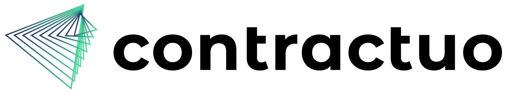

# The assignment
A simple spaceflight news blog website.

## Prerequisites

Below you’ll find some directions to setup the development environment and project.

1. Setup your development environment;

    - node 18
    - IDE of your choosing

2. Checkout the current repository, install the dependencies with the following commands:

    - npm install
    - npm run dev to start the project

## Project details

We have already setup Vue.js, Vue router, and Vuex for you.

Axios is already installed to be used for api calls.

In terms of the UI, we have installed and configured :

-   <a href="https://tailwindcss.com/" target="_blank">Tailwindcss</a>

Feel free to use it or just use custom css.

You should use this api to retrieve the data.

-   <a href="https://api.spaceflightnewsapi.net/v4/docs/" target="_blank">Spaceflight news API</a>

## The assignment

As a user, I want to be able to open the application and get a list of 20 blog articles related to spaceflight in a form of a table. 

## Requirements
The application should have a total of 2 pages.

- Home page (landing page, we provide that), but you need to update the page according to the functionality.
- Show page that presents a preview of each article.
- Ideally, the data retrieved from the API should be saved in the Vuex store and retrieved from the store for the home page.
- For the Show page you should find and retrieve the saved article from the store, if there are articles retrieved (a user clicked from the home page to view an article)
- In the show page, after the user refreshes the page, the article should be retrieved from the API instead of the store.

### Functionality

- Home page: Articles from the API should be presented in a single html table.
- When you click on the row of a single article, it should take you into a second page (show page) specific to this article.
- Show Page - This page should show this article:
    - Image if it includes one
    - the title of the article
    - a link that points to the articles url (the link should have the text: *Open Article*.)
    - When clicking on the text, it should open the article's post in a separate tab.

## Once completed

Upload the application to GitHub and send us a link to the repository in your submission email reply.
